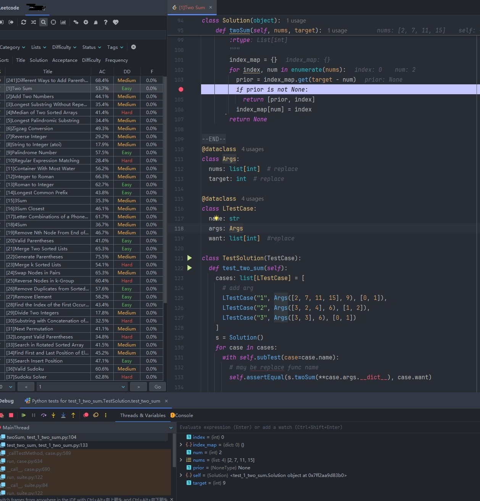

# LeetCode 配置本地调试环境（jetbrains系列和vscode）

## 简介
本项目提供做题模板和测试工具函数,用最简单快速的方式去本地调试leetcode。
支持jetbrains系列和vscode(通过代码片段)

## 动机
在网页刷题太痛苦了，尤其是遇到复杂的测试用例无法通过时，定位问题往往花很长时间。
因此我想用本地ide来单步调试leetcode，毕竟本地单步还是更方便，而且定位问题更快。后来我用pycharm 安了leetcode-editor，这块解决了很大的痛点。但问题是它的默认模板太简单，写测试用例还是太折腾，网上也找不到很好的模板。所以诞生了这个项目，本项目提供这个模板只要配置好参数类型，剩下的只要复制问题描述里的测试用例就可以跑起来了。
目前只有python，后面还有其他语言支持的。
## 效果
### [Python](https://github.com/zonewave/leetcode-precompiled/blob/master/py/README_CN.md)

## 特性
- 支持多种编程语言的工具包,包含官方声明的所有数据结构，如 `ListNode`、`NestedInteger`、`TreeNode` 等
- 提供部分工具函数，比如数组转链表，数组转树，数组转图的，可以更好地本地测试
- 基于 leetcode-editor，提供多种编程语言的template content模板
- 易于使用，适合快速=配置本地调试leetcode 题目环境

## 支持的编程语言
- [Python](https://github.com/zonewave/leetcode-precompiled/blob/master/py/README_CN.md)

## 贡献  
  
欢迎任何形式的贡献！如果您有新的数据结构或改进建议，请提交拉取请求或提出问题。  
  
## 许可证  
  
本项目采用 MIT 许可证，详细信息请查看 [LICENSE](https://github.com/zonewave/leetcode-precompiled/blob/master/LICENSE) 文件。  
  
## 联系信息  
  
如有疑问，请联系项目维护者。