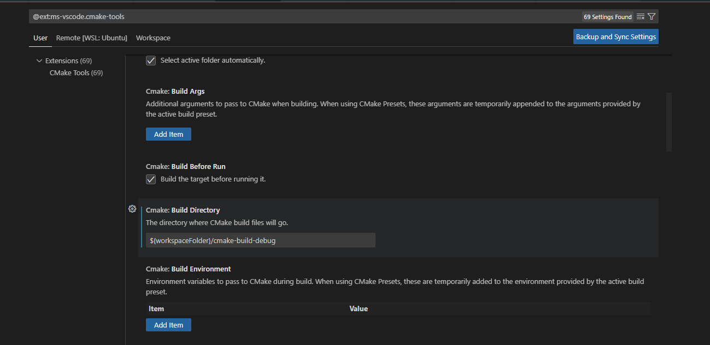
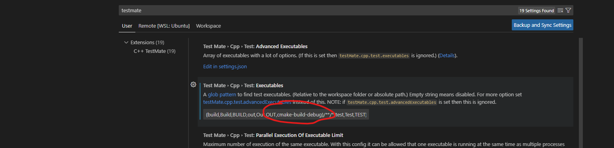

# LeetCode cpp 预编译库

欢迎使用 LeetCode cpp local 库！

[github](https://github.com/zonewave/leetcode-precompiled)


## 本地环境配置说明
因为要用到测试库，还是需要包管理工具。
这里使用cmake(后续可能会给xmake,hunter,conan之类的)，vscode,clion 都可以通用

本地项目 假定目录结构应该是这样的
```
project/
    cmake-build-debug  #构建目录
    cn/  #中文站点
      test_1_two_sum.cpp #解题代码
       ...
    en/ 
      test_1_two_sum.cpp #解题代码
    CMakeLists.txt  #cmake 文件
```

## vscode 本地调试
vscode cpp配置 对新手来说，会比较麻烦，但按下面走不成问题
### 1. 安装官方扩展Leetcode 并配置 

参考官方的说明，配置好账号密码

### 2. 安装c++,cmake tool,cmake,c++ testMate 四个扩展

默认build目录名 是build
如果需要换个build 目录，比如cmake-build-debug，需要改两个地方
设置里 搜索cmake-tools，设定构建目录为 cmake-build-debug，如图下


设置里 搜索testmate，在 excutables 配置 添加 cmake-build-debug，如图下




### 3. 代码路径的配置
settings里搜索leetcode,在filepath 那块打开setting.json,用下面的配置，添加或者替换cpp的文件路径声明

```json
{
  "leetcode.filePath": {
    "cpp": {
      "folder": "cn", //英文站点就用en
      "filename": "test_${id}_${kebab-case-name}.py"
    }
  }
}
```

### 4. [安装工具库](#安装工具库方式)[可选]
写链表，树，嵌套数组时所需的工具库，也可以不安装，用你自己写的。

### 5. 配置用户代码片段 snippet

在窗口左下角设置里 snippets，选择cpp， 生成代码片段文件。

然后把[这里的](https://github.com/zonewave/leetcode-precompiled/blob/master/py/python-snippets.json) 内容，复制过去

### 5. 生成代码片段

点击lc界面里任一题目生成文件后，在空白处，敲击lctest，然后使用tab自动补全，接着根据题意，那样填参数即可

### 6. 配置测试

本模板用的是doctest框架，这是个十分轻量级的测试框架.
编写完测试用例后，需要通过命令面板，执行命令 cmake: build，构建测试。
如果是新增的cpp文件，需要执行 cmake:clean rebuild.


## 安装工具库方式
未支持，但很快等我 或者来个人提交一下

precompiled
本库包含

1. leetcode 官方声明的所有数据结构
2. 本地测试所需的各种工具函数 [api说明](#常用数据结构和方法)

预计先用cmake配置

## 使用说明

// todo 

### 常用数据结构和方法

- **ListNode**：链表节点
    - 默认实现eq方法
    - array_to_list_node 将数组转换成链表，返回头结点
    - arrays_to_list_node 将多个数组转成多个链表，返回以链表为元素的元组
    - index: 返回链表第 idx 个节点， 下标从 0 开始。
- **NestedInteger**：嵌套整数
- **TreeNode**：树节点  
