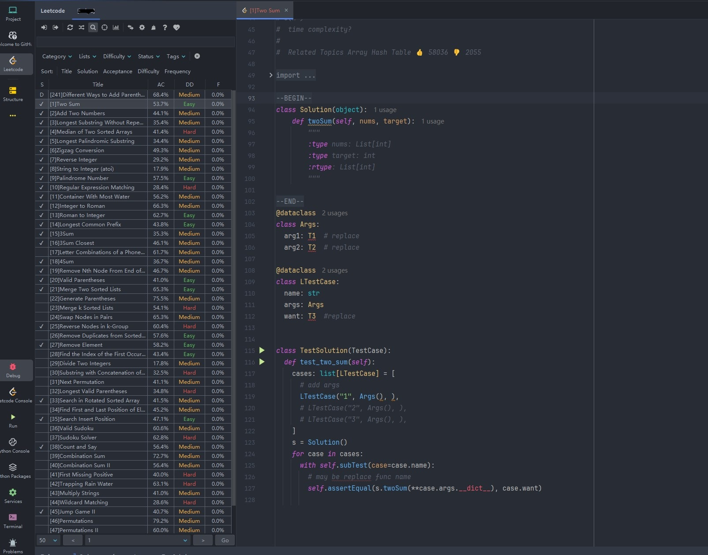

# LeetCode Python  Debug  in pycharm

[中文文档](./README_CN.md)

## How to debug leetcode problem
### install [leetcode-editor](https://github.com/shuzijun/leetcode-editor)

### 


[template content](./jetbrain_editor_template.md)

### click problem and init python file


### replace arg and add test case


## Install tool package

You can install the library using the following commands:

### Using pip

```sh
pip install precompiled
```
### Using pdm

```sh
pdm add precompiled
```
## Usage

Once installed, you can use the following import statements in your Python code to access all data structures from LeetCode:

python

```python
from precompiled.listnode import ListNode 
from precompiled.nestedinteger import NestedInteger 
from precompiled.treenode import TreeNode`
```
### Common Data Structures and Methods

- **ListNode**: Linked list node
    - Default implementation of the`eq`method
    - `array_to_list_node`: Converts an array into a linked list, returning the head node
    - `arrays_to_list_node`: Converts multiple arrays into multiple linked lists, returning a tuple of linked lists
- **NestedInteger**: Nested integer
- **TreeNode**: Tree node

